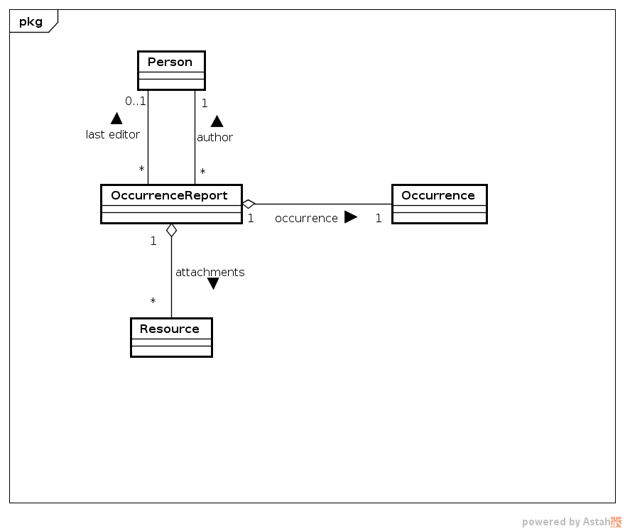

# oom-benchmark

Benchmark of OOM libraries.

Currently supported libraries:
* [AliBaba](https://bitbucket.org/openrdf/alibaba/)
* [Empire](https://github.com/mhgrove/Empire)
* [JOPA](https://github.com/kbss-cvut/jopa)
* [KOMMA](https://github.com/komma/komma)
* [RDFBeans](https://rdfbeans.github.io/)

The benchmark is executed against a locally running RDF4J server.

### Specification

The following types of operations are benchmarked (each separately):
* Create
* Retrieve

##### Create

Create benchmark persists all the persons in one transaction. Then, to simulate a different mode of operation, the reports
are persisted one by one in separate transactions. This means that each transaction persists the report, its occurrence and attachments.

##### Retrieve

Retrieve benchmark retrieves all the reports, checking for their attributes and some attributes of the referenced entities (e.g. contacts
of the report's author and last editor, name of the reported occurrence).

#### Model

The benchmark uses a relatively simple model consisting of the following entity classes:
* **Person** contains basic information about a person, all modelled as data properties,
* **Occurrence** contains basic information about an occurrence, its temporal specification and name,
* **OccurrenceReport** represents a report documenting an occurrence. It references the occurrence (a 1:1 relationship), person as its creator and last editor and a set of resources as attachments,
* **Resource** represents a reference to an external resource, be it a file stored on local file system or a remote URL.

The model is depicted in a diagram below:

#### Data

The benchmark generates a number of persons, occurrences and reports. The exact number can be found in `cz.cvut.kbss.benchmark.util.Constants`.
All of these are persisted either as part of the Create benchmark or during setup of other types of benchmark.

Each report is assigned a random person as creator and another as last editor. An occurrence is generated for each report since they 
are in a 1:1 relationship. Each report is also assigned three randomly generated attachments, which are persisted with it.

All attributes of all entities are set, none is left empty. Also, lazy loading is disabled on entities.

The data are generated in `DataGenerator`.

### Execution

The benchmark cleans up the repository after each round and uses a new persistence context for each round.

Number of executions can be configured using the **-w** and **-r** parameters, where:
* **-w** is the number of warmup rounds, which are not measured,
* **-r** is the number of measured rounds.

In addition, it is possible to configure the benchmark to output each round's execution time into a file for further investigation.
This is done using **-o** parameter with value specifying the target file.

`benchmark.sh` contains a predefined configuration. It executes the benchmark on all supported libraries and outputs the results into `benchmark.log`.

